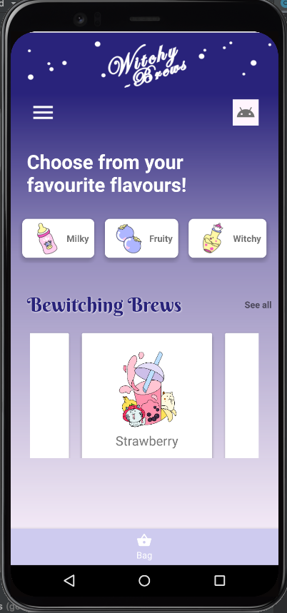
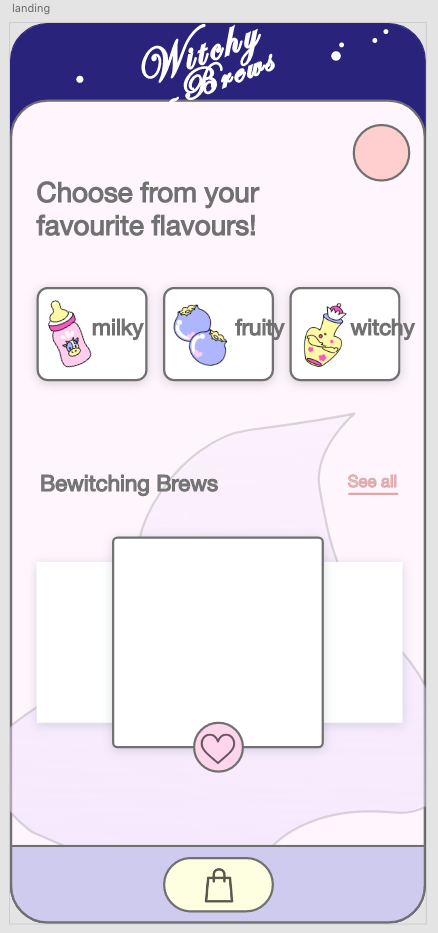

# witchy-brews

uOttahack 2021

Themes: Covid-related things.

I thought about how quarantine impacted my life and decided to make an android app prototype for a new kind of business: deconstructed bubble tea.

Having gone to University downtown, swinging by tea shops between class for a sugary caffeine-fuelled treat was a constant for me. Even after lockdown, I craved for the sweet chemically induced endorphins constantly. However, expensive delivery services held me back and I had wished for a time, fresh tea shop businesses would convert to selling dehydated bulk versions of their teas and toppings, so I can buy them in boxes and reconsitute them at home myself.

# Project

A one-page UI fantasy prototype for a bulk-buy, mail to your home Amazon-style, rehydrate with hot (or cold) water (or beverage of your choice) at home yourself boba tea and toppings business.

Style: appealing to myself.

Android app: I was responsible for backend and database components last time I had an android project, so now I want to learn how android app UIs are made.

## Tutorials

- [circular user image](https://www.youtube.com/watch?v=InkQJ4riGyI) - didn't end up using.

- [card view](https://www.youtube.com/watch?v=YKssd_9x8Eg) for building 3 cards in a row.

- [city guide tutorial](https://www.taimoorsikander.com/city-guide-dashboard/) for layout.

- [recyclerview carousel](https://www.youtube.com/watch?v=QwMmBHA1RrE) for building recyclerview.

## Learnings

As of February 13, the app looks like this:

The design in Adobe XD:

Check out the [assets folder](assets/) for progress pictures.

Things I learned:

1. Hand drawing graphic art pieces for an app is a pain. I really have no idea how to get the dimensions and thickness of lines just right from my drawing application to the graphic when used in the android app.
1. Android UI framework is actually very similar to web frontend's HTML/CSS frameworks.
1. I really wish this was a real product/app. Half a year into quarantine, my memories of delicious bubble teas are fading.

## Future Work

If I ever come back to revisit:

1. Mock up more individual "drinks" pages and make it more obvious that what's sold isn't fresh bubble tea but tea parts.
1. Adjust the graphic art.
1. Replace basic UI components with UI libraries that are more interesting - for example, I'd like to try using Android's Material Design components.

## Ref

Graphic inspirations: 

["juice"](https://dribbble.com/shots/10029626-Online-Food-App)

["witchy"](https://dribbble.com/shots/13405767-Fantastic-Magical-Icons)

## Icon Attributions

I used some of Android Studio's vector assets in the application. The heart and bag icons in Adobe were from Freepik.

Icons made by <a href="https://www.freepik.com" title="Freepik">Freepik</a> from <a href="https://www.flaticon.com/" title="Flaticon">www.flaticon.com</a>
